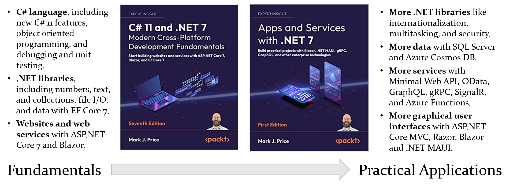

# Dotnet 7

- [Dotnet 7](#dotnet-7)
  - [C# 11 and .NET 7: The book](#c-11-and-net-7-the-book)
  - [How to read](#how-to-read)
    - [Folders, folders everywhere](#folders-folders-everywhere)
    - [.Net Interactive notebooks?](#net-interactive-notebooks)
  - [Microsoft .NET community support and others](#microsoft-net-community-support-and-others)
  - [Where to find the original books solutions](#where-to-find-the-original-books-solutions)

 Programming is always evolving, new techniques, new approaches, new everything.  
 Dotnet is of course not an exception, the new [Dotnet 7](https://dotnet.microsoft.com/en-us/download/dotnet/7.0) is the new standard. Of course we need to adapt to all new changes, technologies, and features. I am not the exception ether, Let's see what's new, and what I can do with the New  Dotnet.

## C# 11 and .NET 7: The book

 This repo contains the solution files of all the exercises in two books:

- [C# 11 and .NET 7 – Modern Cross-Platform Development Fundamentals - Seventh Edition](https://www.packtpub.com/product/c-11-and-net-7-modern-cross-platform-development-fundamentals-seventh-edition/9781803237800)
- [
Apps and Services with .NET 7](https://www.packtpub.com/product/apps-and-services-with-net-7/9781801813433)

both books by [Mark J. Price](https://github.com/markjprice), here is a picture he make available on [his repo](https://github.com/markjprice/cs11dotnet7):

 He made two separated repos, I, however decided to keep it simple, and made only one for both books.

## How to read

 We are programmers, so we love conventions, right?  
 I'll be following [Microsoft's recommended naming convention](https://learn.microsoft.com/en-us/dotnet/csharp/fundamentals/coding-style/coding-conventions) in this repo, as well as all my other repos. If I change my mind, I'll probably going to mention here.

### Folders, folders everywhere

 I love organizing  stuff in their's respective directory, so you are probably going to see a lof of folders, each containing an isolated topic, as it is supposed to be.
 You are also not going to see spaces in file names, I always avoided them, and I think it is quite a good practice in programming. Example:  
`FileName.cs` -> good 👍  
`File Name.cs` -> bad 👎

### .Net Interactive notebooks?

 I probably going to use them, but I am not not quite sure yet, I don't really like the performance, but bth, I love the look and feel.

## Microsoft .NET community support and others

- [.NET Developer Community](https://dotnet.microsoft.com/platform/community)
- [.NET Tech Community Forums for topic discussions](https://techcommunity.microsoft.com/t5/net/ct-p/dotnet)
- [Q&A for .NET to get your questions answered](https://docs.microsoft.com/en-us/answers/products/dotnet)
- [Technical questions about the C# programming language](https://docs.microsoft.com/en-us/answers/topics/dotnet-csharp.html)
- [.Net subreddit](https://www.reddit.com/r/dotnet/)
- [CSharp subreddit](https://www.reddit.com/r/csharp/)
- [C# Discord (Community)](http://aka.ms/csharp-discord)

## Where to find the original books solutions

 This repo covers two books, here are the original solutions (By [the author](https://github.com/markjprice)):  
 [C# Fundamentals](https://github.com/markjprice/cs11dotnet7)  
 [C# practical](https://github.com/markjprice/apps-services-net7)

----

Don't forget to wish me luck! (Please)
